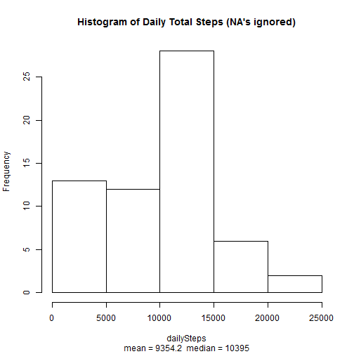
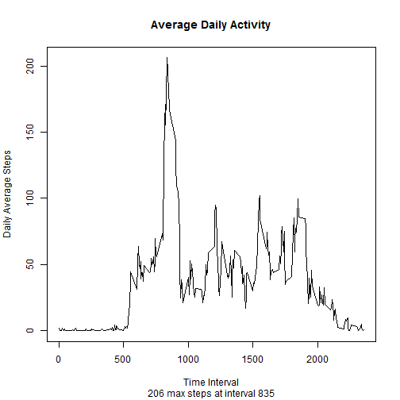
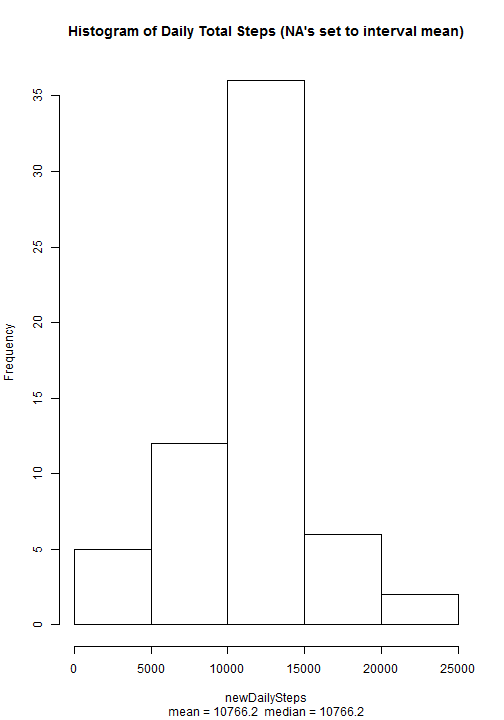
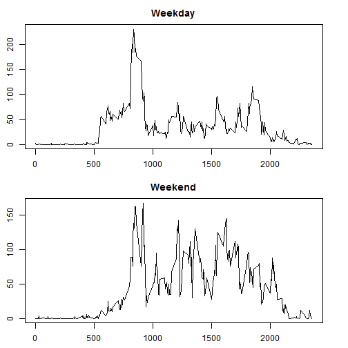

Load the data and convert date strings to a date format:


```r
data <- read.csv("activity.csv",
                 colClasses = c("numeric", "character", "numeric") )
```

Calculate mean of total daily steps and create histogram:


```r
dailySteps <- tapply(data$steps, data$date, sum, na.rm=TRUE)
dailyMean <- mean(dailySteps, na.rm=TRUE)
dailyMed <- median(dailySteps, na.rm=TRUE)
hist(dailySteps,
     main="Histogram of Daily Total Steps (NA's ignored)",
     sub=paste("mean =", round(dailyMean, digits=1), 
               " median =", dailyMed))
```

 

Calculate and plot mean steps across all days, by interval


```r
intMean <- tapply(data$steps, data$interval, mean, na.rm=TRUE)
maxInt <- names(which.max(intMean))
maxSteps <- round(max(intMean), digits=0)
plot(as.numeric(names(intMean)),
     intMean,
     type="l",
     main="Average Daily Activity",
     sub=paste(maxSteps, "max steps at interval", maxInt),
     xlab="Time Interval",
     ylab="Daily Average Steps" )
```

 

Calculate and print number of NAs:


```r
NAs <- is.na(data$steps)
print(paste("Number of time intervals with NAs is", sum(NAs) ) )
```

```
## [1] "Number of time intervals with NAs is 2304"
```

Now we replace missing data with the mean for that interval and plot histogram:


```r
#Create new data table
newData <- data

#Calculate number of days (i.e. number of times to repeat 
#each day's interval data to recreate #a full 2-month data set)
numDays <- nrow(newData) / length(intMean)

#Replace missing values with interval means.
newData$steps[NAs] <- rep(intMean, numDays)[NAs]

#Recalcuate daily averages and plot
newDailySteps <- tapply(newData$steps, newData$date, sum, na.rm=TRUE)
newDailyMean <- mean(newDailySteps, na.rm=TRUE)
newDailyMed <- median(newDailySteps, na.rm=TRUE)
hist(newDailySteps,
     main="Histogram of Daily Total Steps (NA's set to interval mean)",
     sub=paste("mean =", round(newDailyMean, digits=1), 
               " median =", round(newDailyMed, digits=1) ) )
```

 

```r
meanDiff <- round( abs(dailyMean - newDailyMean), digits=1 )
medDiff <- round( abs(dailyMed - newDailyMed), digits=1 ) 
```

Note that the mean and median change when we impute missing values.  The absolute difference in the mean is **1412 steps** and the absolute difference in the median is **371.2 steps**.  

Finally, plot daily averages for Weekday vs Weekend:


```r
#Convert strings to dates
newData$day <- weekdays(as.Date(newData$date, "%Y-%m-%d"))

#Find which days are weekends
newData$dayType <- "Weekday"
newData$dayType[newData$day %in% c("Saturday", "Sunday")] <- "Weekend"
newData$dayType <- as.factor(newData$dayType)

#Extract weekend and weekday data
wkday <- tapply(newData$steps[newData$dayType == "Weekday"],
                newData$interval[newData$dayType == "Weekday"],
                mean)
wkend <- tapply(newData$steps[newData$dayType == "Weekend"],
                newData$interval[newData$dayType == "Weekend"],
                mean)

#Plot weekend and weekday data
par(mfrow=c(2,1), mai=c(0.5,0.5,0.5,0.5))

plot(as.numeric(names(intMean)),
     wkday,
     main="Weekday",
     xlab="",
     type="l",
     ylab="Daily Average Steps" )

plot(as.numeric(names(intMean)),
     wkend,
     main="Weekend",
     type="l",
     xlab="Time Interval",
     ylab="Daily Average Steps" )
```

 
